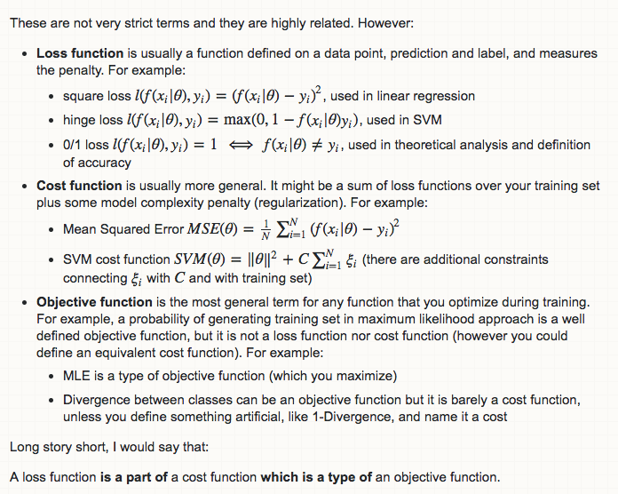
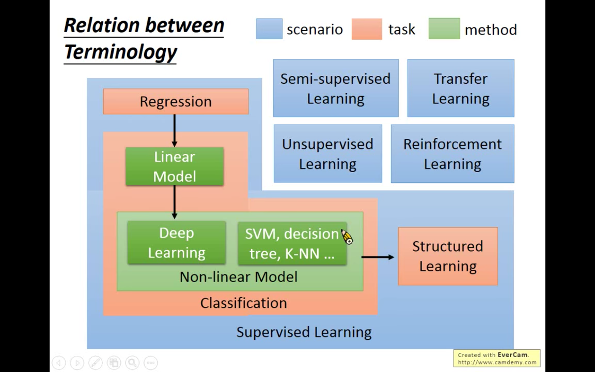
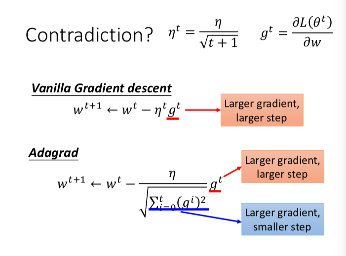
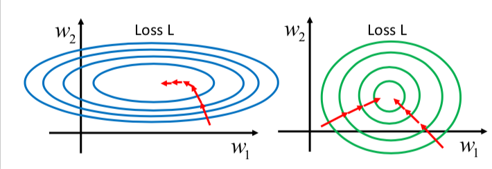

## cslkkdui

Jp uz xm ui，cs lk kd ui 的笔记。

## ML Lecture 0-1: Introduction of Machine Learning

###  机器学习、深度学习简介
手动编写规则的重大缺陷（数以万计的 IF） —> 引入机器学习
，举例处理具体的任务时，机器学习方法是怎么做的，预期达到什么效果，以此来介绍什么是机器学习，拟人化 -> 

> 以前是教机器怎么应对各种情况，那样要把所有情况都 IF 进程序里面（规则的方法）。现在是教机器怎么学习判断，最后在程序里的是一种判断方法（函数 f），且这种判断方法（函数）往往过于复杂，无法由人来洞察规律来编写，但是可以通过学习来习得。通过数据的学习，学出来的其实是一种概率分布？

数学上的机器学习，找到一个 function 来完成任务，这个 function 很复杂，人是找不出来的。（就好像，解一个方程（找到做某一任务的规律，判别标准），直接解或者是太复杂，或者是解不出来，我们就用计算机的迭代计算能力去得到近似解，对比到机器学习的训练方法就是，拟合？） -->

### Framework -机器学习
1. design a Model （ A function set）
2. define the objective function
3. design a method to find the best function under specific objective function. ( design the Loss function , decide the optimization method )

( What's the difference between the evaluation function and the Loss function ? @acat)

下面这张图好像与我的问题并没有什么关系😂， 而且在我看视频的这门课中，老师就是将 Loss function 与 采用什么样的 loss 区分开，他讲解时，就把 loss function 当成 要最小化的目标函数。
 
 PS： Loss function: L(f)，他的自变量是模型的函数参数，可以将他看成是关于模型的函数。

### learning map

## ML Lecture 1: Regression - Case Study

1 举例介绍 Regression —— 引入例子，宝可梦进化之后的 CP 值（神奇宝贝战斗力），在之前的 Framework 下进行分析 ——  之后 Pokemon 的例子贯彻这一章的内容，听起来十分有趣，像是在听游戏攻略一般。

2 Gradient Descent	
简单介绍，怎么算（和 NG 的视频说得类似，引入性质）
针对要求解极值的函数，计算出梯度，然后按照逆梯度方向更新参数，迭代，设定迭代次数让它停止。
（为什么梯度下降能到极小值，为什么能收敛，这些原理性方面的东西暂时未提及）

### 3 overfitting 
竟然举例 用的是 学车（考试场地的开车 —— 公路上开车）

拟合得不好的时候，要考虑是否有未考虑在模型里的重要影响因素。
hidden factor 造成的（你在箱子里的 函数 可能都是不好的）
VS 还是 Random noise 

### Regularization

why smooth better ?
想要学出来的函数越平滑 == 函数参数的值越接近于0
函数参数接近于0，则对噪声，及自变量的改变更不敏感。（ 应该还有其他原因未被提及，此处这是直观介绍这一原因。
如果有必要，自己可以扩展，搜索一下） 

## ML Lecture 2: Where does the error come from?

来源：Bias，variance

均值 （无差估计 —— 对样本求均值，得出的均值就是原来分布的均值）
方差 （有偏差的估计—— 对样本求方差，得出的方差不等于原来分布的方差。要修正，有以下等式

$E(s^2) = \frac{N-1}{N}\sigma ^2 $ 

你从样本中计算出来的方差相比 实际分布的方差是偏小的，要乘以 n/n-1 做修正。

### Bias Variance Trade-off

***再补充一点？***

## ML Lecture 3-1: Gradient Descent

0 review gradient descent

### 1 learning rate
学习步长问题。 如何选择合适的学习步长？

首先，要知道 learning rate 设置的好不好，要把 Loss - No. of parameters updates 这一张图画出来。

直观来说，随着参数的更新，学习率应该越来越小（让参数的值更新幅度越来越小）
所以，学习率是变化的，那么如何变化呢？ 

有自适应的设置学习率的方法  Adaptive Learning Rates

而且 
> Learning rate cannot be one-size-fits-all

同一模型中的 不同参数 的 学习率（更新幅度）是不一样。我们要给每一个参数个性化的学习率。

其中一种常用的自适应方法，叫 Adagrad.
它更新学习率的方法是 

learning rate = $\frac{\eta ^t}{\sigma ^t}   $

$ \eta ^t = \frac{\eta}{\sqrt{t+1}} $ 

$  \sigma ^t = \sqrt{\frac{\Sigma g_i ^2}{t+1}} $

代入化简之后的 learning rate 就是 $\eta / \sqrt{\Sigma g_i ^2}$ 

g_i 是第 i 次计算的 梯度（数值上 对应参数的偏导数）

**contradiction**

1 一种理解是 反差， 现在的梯度 与过去梯度和的比值，可以看成现在梯度相比过去的一种反差程度的衡量。 

2 最好的步长是 一阶导数/二阶导数 的比值。
然后 $\sqrt{\Sigma g_i ^2} $ 可以看成是 此处二阶导数 的近似估计。

### 2 SGD （随机梯度下降法）
 **@acat 要知道他的几种变种的简单区别，如 batch-SGD ， min-batch-SGD。之后补充** 

SGD 相比 梯度下降，***SGD 的收敛速度跟快***。	

### 3 feature scaling
将特征缩放到统一单位，有助于梯度下降法 去 寻找极小值。
一看图就明白了，

其中一种常用的特征缩放，是将变量变成标准变量（在概率论中提及 均值为0，方差为1）
即 
$x = \frac{x-E(x)}{\sqrt{var(x)}}$

### 4 Gradient Descent Theory
why it work? 就是为什么逆梯度方向是找最小值最好的方向，函数值下降最快的方向？

**泰勒展开式的论述**  待补充：自己的论述
在小范围内的，在（a，b）用泰勒展开式，对 $L(\theta)$  的近似，
一阶泰勒展开式 == $ L(\theta) \approx L(a,b) + (x - a)\frac{\partial L(a,b)}{\partial \theta _1}  + (y - b)\frac{\partial L(a,b)}{\partial \theta _2}$

在这个小范围内，往哪里走能找到最小值呢？
即 在 $ (x-a)^2+(y-b)^2 \leq \delta ^2 $ 内，求 $L(\theta)$ 的最小值，
因为用 一阶泰勒展开式进行了近似，那么问题就是 在
$ L(\theta) \approx L(a,b) + (x - a)\frac{\partial L(a,b)}{\partial \theta _1}  + (y - b)\frac{\partial L(a,b)}{\partial \theta _2}$
下的最小值，
把两个偏导数组成一个二维向量，记为 v，（x-a,y-b）看成是一个以（a，b）为起点的二维向量,记为 u，那么那个展开式就可以看成是 $L(a,b)+ u \cdot v  $  那么，要使 $L(\theta)$ 最小，那么就要向量內积最小，那么方向自然就是 v 的相反方向，就是梯度的反方向。而且步长是 d，但是泰勒公式的小范围的尺度 d 是不知道的，谁知道多小才足够小 以使得泰勒公式展开式的近似对于要近似的函数成立，所以这种方法，更新参数时，会出现更新之后 Loss 变大的情况，（这时候说明近似范围与实际范围不符，或其他原因），不过，**最后，这种更新方式最终会收敛呀！！** （不过，只是最终会收敛，而对于收敛速度倒是没有提及，也就是毫无保障？？ 有兴趣，后续还可以查查资料。 @acat）

### More Limitations of Gradient Descent

其实有很多你不知道的限制 233

1 在函数平滑的地方（plateau 平原），下降地非常缓慢

2 会被卡在鞍点 (一个不是局部极值点的驻点称为鞍点）

3 会被卡在 局部最小值点

其他更多的细节 (后续对比中 再想，再补充，现在先放下）
参考一下：

https://zhuanlan.zhihu.com/p/32626442

https://zhuanlan.zhihu.com/p/22252270

http://ruder.io/optimizing-gradient-descent/

 
 	
