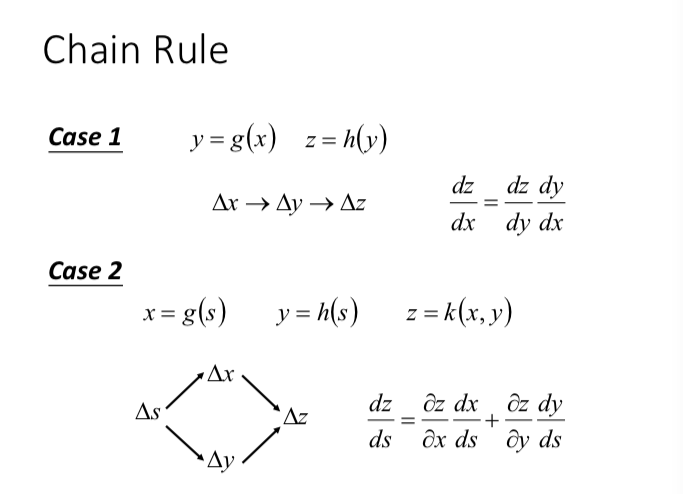
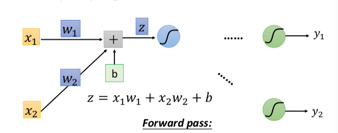
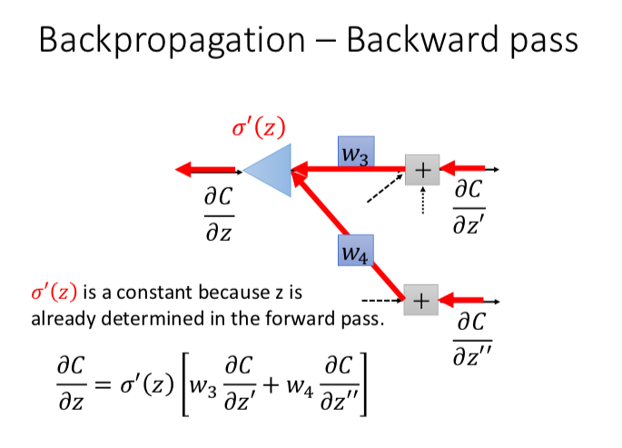
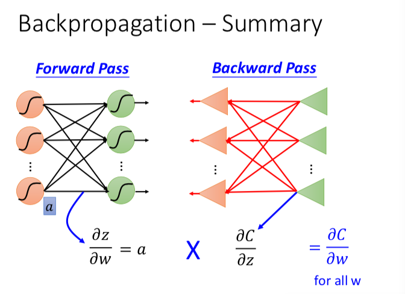

# ML Lecture 6: Brief Introduction of Deep Learning

## Ups and Downs of Deep learning 
要是能像 Lee 一样，用自己的语言叙述出来，讲明重要的 up Downs 的起因和结果就好了。

### Three steps for Deep learning : Framework 

1. a function set (decided by the network structure
2. goodness of function
3. pick the best function   

之后是演示怎么算，前向计算神经网络的输出

### matrix operation
矩阵表示 - 运算 
写成矩阵运算，然后算矩阵的时候，就调用 GPU 去算(GPU 可以将矩阵运算并行化，大大提高矩阵运算的效率），这样整个训练过程就快许多。

### 从传统的机器学习方法 到 DL/DNN  

> DL 并没有把做机器学习变得更简单，只是把一个问题转化为了另一个问题，
原来是 特征工程，设计好的特征，
用 DL 就是设计网络的结构。 究竟 DL 是不是好用，看你觉得对于你的任务，哪一个比较简单。

### What are the benefits of deep architecture?
Why “Deep” neural network not “Fat” neural network?

# Ml Lecture 7: Backpropagation
本来想看一下提出 BP 的原始论文，后面找到历史上去了，有时间可以看一下
http://people.idsia.ch/~juergen/who-invented-backpropagation.html

让 BP 发扬光大的论文也先不看吧，免得在此处离题太远。以后考虑，maybe。

BP 的产生缘由是这样子的：当 NN 网络参数很多的时候，层数又多得情况下，你要用梯度下降法去训练网络参数，求 $ \frac{\partial error}{\partial \theta} $ 会是一个麻烦的计算问题，参数有多，层数又深（表明链式法则要用不知道多少次），怎么算就是一个亟待解决的问题。这个时候，BP 就闪亮登场了，它解决的就是计算众多参数梯度的问题，它就是一个让你更有效的计算网络参数梯度的算法。
>（@acat 我感觉它的思路跟动态规划挺像的，说白了就是，避免重复计算，有效利用已经计算出来的偏导数，从简单的开始拼接，一步一步利用已有结果到达深层网络参数的偏导数，“循序渐进，屡试不爽”。）

### 首先要复习一下，求导的链式法则

### 然后就可以开始 BP 算法 的推导了
推导过程，视频讲得非常好。我也听懂了，现在就要用我的语言叙述一遍，让他变成我的论证过程，这一点是必不可少的。

下面就开始我的 三脚猫式论证叙述：

我们要求的梯度 是 $ \frac{\partial C}{\partial w}  $ C 就是要优化的函数。
直接求，很复杂，怎么办？ 

1. 不求了，去找一种不需要计算梯度的优化方法（看来是没有找到）
2. 转换。转换成另一种容易计算的等式。于是，我想，他们就很神奇地找到了一种神奇的算法，真不知道他们是如何想到这个巧妙的算法的，不过话又说回来，让我觉得巧妙的东西实在是太多了😂。（莫非我是一个容易惊叹的人，起名叫 一只容易惊叹的三脚猫 😂）

转换，等价转换成另一种容易计算的。在 BP 里就是转换为

$ \frac{\partial C}{\partial w} = \frac{\partial output}{\partial w} * \frac{\partial C}{\partial output}$

利用求导链式法则进行的转换。

output 是某一层网络激活后的输出。所以，$\frac{\partial output}{\partial w}$ 是很好求的，观察一下网络的结构，不妨假定你的激活函数是 SIGMOD，其他也同理可得。 此时的你的某一网络层输出 $ output = \sigma(z) $

从图中，你求 $\frac{\partial output}{\partial w}$ 是这样求的。
$\frac{\partial output}{\partial w} = \frac{\partial \sigma(z)}{\partial z} * \frac{\partial z}{\partial w} $
 
 其中 $\frac{\partial \sigma(z)}{\partial z} =  \sigma(z)(1-\sigma(z))$
 
 $\frac{\partial z}{\partial w} =  x $ 
  x 为上一层给这一层的输入。最开始就是特征输入。
 
一层一层网络，从前往后计算，就可以算出我们要的所有参数的第一项 $\frac{\partial output}{\partial w}$

还有第二部分，就是

$\frac{\partial C}{\partial output}$

如果你从后往前考虑的话，这个东西等于什么呢？

对于输出层（方便起见，也用 SIGMOD），output 就是 直接的 output，此处假定 C 用的是 cross Entropy，不妨简单起见，就让这里的输出只有二维 

$ C = \sigma - Y \ln output = -y_1\ln ouput_1 - y_2\ln output_2 $ 

那么 这一项 

$\frac{\partial C}{\partial output} = \frac{-y_1}{output_1} + \frac{-y_2}{output_2}$

又 output 在前向计算那一部分就已经求出，所以上面那一项的数值是确定。

对于非输出层，

$\frac{\partial C}{\partial output} $ 等于 （C/输出层output） * （输出层 output/上一层的 output），前一项已知，后一项的计算等于 

$ \frac{\partial \sigma(z)}{\partial z} * \frac{\partial z}{\partial x}$ 

后一项是与输入这一层相关的 weights （与一个输入相关的 weight 有多个，此处要用链式法则。

示意图大概是这样子：

 

所以最后的 summary 可以是这个样子：

(@acat 你说的 output，和上图用的 z，其实是一样的，z 可以看成是上一层的输出，也可以看成这一层的输入。之后再做一下微调吧，以上写得感觉有点小问题。但是大体的推导过程，原理，我已经完全理解并掌握。）

# ML Lecture 8: “Hello world” of deep learning

Keras 的 helloworld 程序

MNIST Data: http://yann.lecun.com/exdb/mnist/

用手写数字识别。

Keras 中fit函数 （训练模型 调用的函数）
mini-batch 的意义
epoch

Speed 问题

Speed - Matrix Operation

之中提到的 GPU 加速矩阵运算（大致是怎么加速呢？或许可以查一下）

	
## ML Lecture 8-3: Keras Demo

