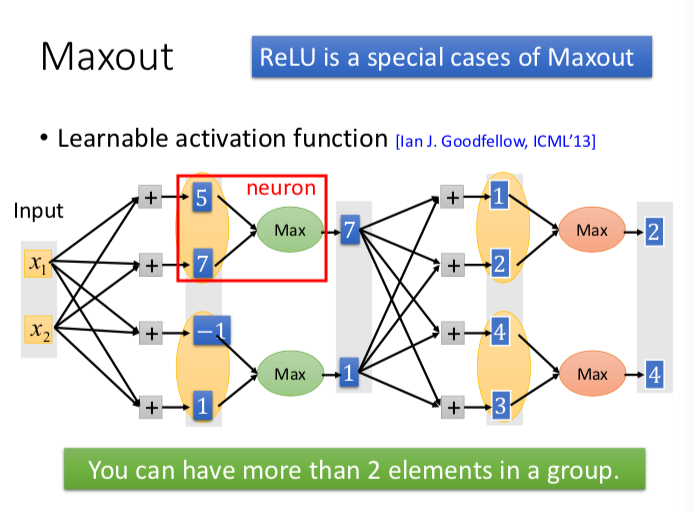

# ML Lecture 9-1: Tips for Training DNN

**TODO**
> dropout 部分的编写

在训练 深度神经网络 DNN 的时候，会遇到两种类型的问题。
一种是 模型 train 不好，即在 training 数据集上的表现就不好；另一种是 train 好之后，在测试集上的表现不好。下面分别介绍这两种情况下的一些应对方法，一些 tips

这张图很好，我就直接贴上来了。

### Do not always blame Overfitting
不过注意，不要 模型的效果一不好就说 overfiting。因为可能是你没有 train 好它，导致它的威力发挥不出来呀。要综合模型在训练集、测试集上的效果综合判断呀！

# 训练 DNN 的 tips 
deeper 会遇到一个梯度消失问题， vanishing Gradient Problem
 
## 1 新的激活函数 —— 梯度消失
梯度消失的问题，说的是梯度这一数值（变化量）随着一层一层地传递，会逐渐减小，这是由激活函数引起的，经过类似 SIGMOD function 的激活函数后，变化量（数值）会被缩小，如下图所示。

改变量会随着层数变大而不断变小，这样的话，当网络层数深的情况下，使用 BP 训练模型的时候，误差对参数的梯度，是从后向前传播的，这时变化量传到输入层等前面网络时，变化量被缩小了很多，就会使前面网络层的参数更新幅度与后面网络层参数的更新幅度相差很大，这样他们的收敛速度就会相差很大，也就极有可能出现模型已经训练收敛，而前面网络层的参数却没有更新多少，和最初的随机初始化参数相差不大。
附加回想的参照，可见下图：

### 梯度消失的解决方案
既然是因为激活函数引起的，那么我们就尝试换一个不会缩小变化的激活函数呗，不过注意是要非线性的激活函数。

那么，ReLU 就闪亮登场了。

ReLu： Rectified Linear Unit 
用他的好处有以下四点：
1. 容易计算偏导数
2. 生物学上找到的理由
3. 可以解决梯度消失的问题

其他 ReLU 的变种有：Leaky ReLU，parametric ReLU  等

### Maxout

**Learnable activation function [Ian J. Goodfellow, ICML’13]**

把激活函数用以下这个红框中的部分来代替，其他不变。

maxout 所形成的激活函数，你从数学上简单一想就知道了。其实就是多条直线互相比较，然后在一定区间取更上方的那一段 所形成的多段直线连接；他的形状可以是各种各样的，只要你增加 group 里面的 elements 。 简单见下图的示例：

Training 过程 和 ReLu 是类似的。

> @acat Maxout 这种激活函数现在用的多吗？效果怎么样？ 怎么听说得不多？？ 可以查一下？？

## 2 自适应的学习率 Adaptive Learning Rate

回忆一下 Adagrad，以下这种图真是精辟呀！！

在 训练 NN 中，Loss 函数可能会出现下面这种情况，（即使你在一个方向上，梯度变化也是不一样的，这个时候 Adagrad 就无法很好地应对了）

RMSProp （对比 Adagrad 就是，Adagrad 中的学习率除以的 $ \sigma ^t = \sqrt{\Sigma (g^t)^2} $ 而 RMSProp 会将以前的梯度值的影响调小，就是换为

$ \sigma ^t = \sqrt{\alpha (\sigma ^{t-1})^2 + (1- \alpha)(g^t)^2} $
其中 $\sigma ^0 = g ^0$,一个递推的公式。$\alpha$ 是要你自己设定一个值。
幻灯片上的描述就是 RMSPro 就是
>  Root Mean Square of the gradients with previous gradients being decayed

### Hard to find optimal network parameters
训练 DNN 时，相比陷入局部最优这一问题，我们更经常面对的问题是，找不到好的模型参数。

在自适应的学习率中，我们解决的是参数更新幅度、步长的问题，但是参数是一个多维向量，我们还要探讨一下 有没有比逆梯度方向更好的更新方向问题。

它这里给出了个 应该是在实践过程中效果不错的，新的更新方向。名字叫做 Momentum （动量吗？）
把更新方向 变为：此刻的逆梯度方向 + $\lambda$ *上一步参数的更新方向， （两个方向向量相加之后得到的新向量的方向）。
$\lambda$ 理解为衰减率，即上一步的参数更新方向对当前的影响大小，也是要你设定一个值，像 RMSProp 里的\alpha 。

理想的 Momentum 达到的效果示意图：

优化方法 Adam 就是 RMSProp + Momentum

# 测试集上效果不好时的 tips

有三招：
1. early stopping
2. regularization
3. dropout

early stopping 就是，一看图就懂如何操作了，

 
### Regularization

加入 L2 正则后（就是 + $ \lambda \Sigma (w_i)^2 $），求偏导数，在梯度下降更新参数那里就变成了
从 $ w^{t+1} -> w^t - \eta \frac{\partial L}{\partial w} $
变成 $ w^{t+1} -> w^t - \eta \frac{\partial L'}{\partial w} = (1-\eta \lambda)w^t - \eta \frac{\partial L}{\partial w}$
而 $\eta,\lambda $ 都是很小的值，那么 $(1-\eta \lambda)$ 这一项 就起到 weight decay 的作用。

L1 正则项  （就是 + $ \lambda \Sigma |w_i| $
对比 L2 ,L1 正则加入之后，对参数更新的影响，见下图：

sgn 是一个符号函数，自变量大于0，函数值为1，小于0时，函数值为-1.
L1 正则的化，影响参数更新就是 它始终会减去（加上）一个小的值。
而 L2 则是通过乘以一个接近1的比率来对参数更新幅度进行减小。 

**L1 与 L2 的比较，优劣势 这里则没有提及。**

## dropout

需要重读一遍 PPT，这里很重要。需要认真写。写得越详细越好，我想，2018年04月18日21:49:19

首先是 dropout 是什么，怎么做的，

第二，是它为什么能起到作用？

1 Intuitive Reason

2 through math to find a reason: Dropout is a kind of ensemble

