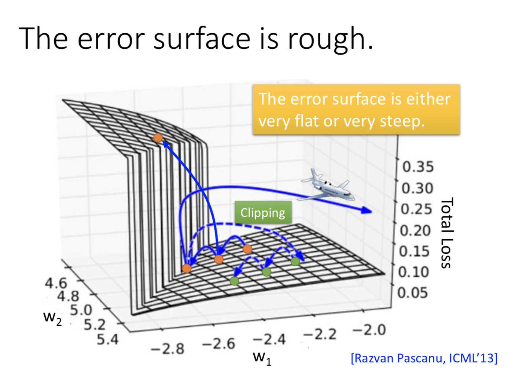
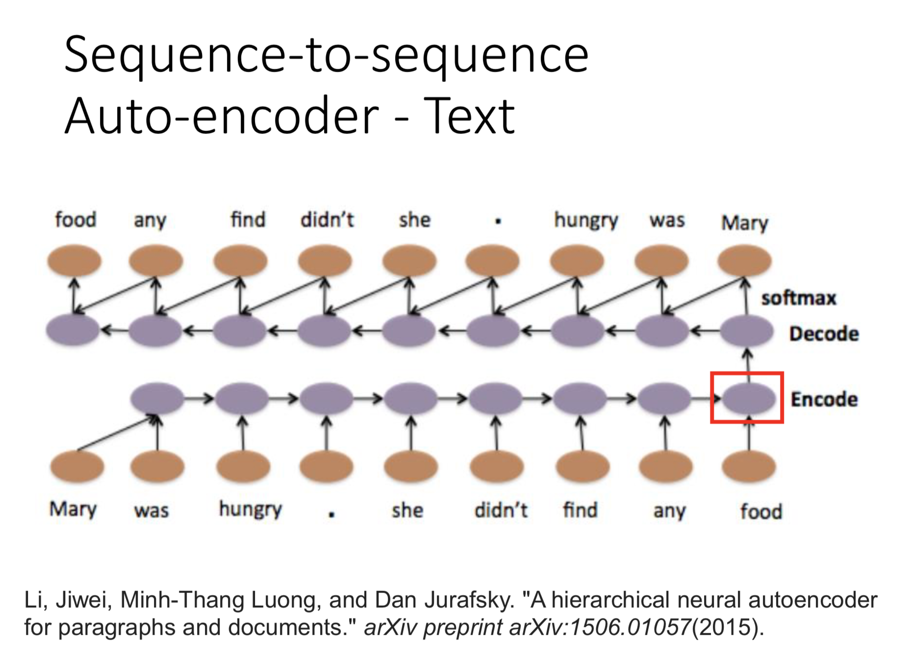
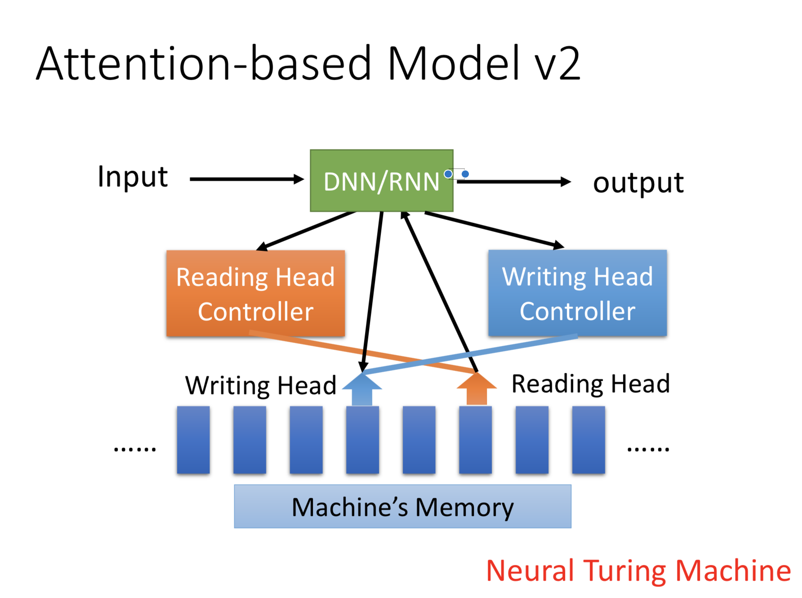
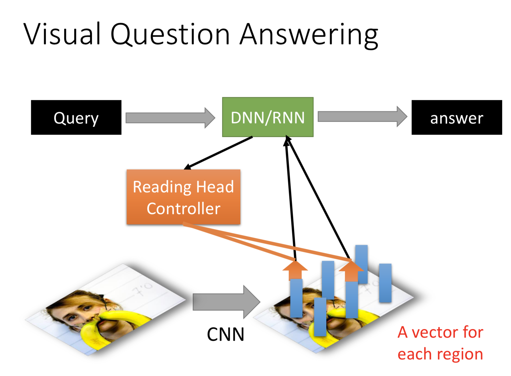

# Recurrent Neural Network
### 1 引入
从一个对话系统要做的一个任务 —— slot filling 开始引入。 举例如果用 CNN
等 feedfore network 去做会有什么困难和问题，然后引入 RNN，RNN 的循环特性让他能够让它结合上下文的信息，避免 CNN 在这个任务中的缺陷。（ RNN 一开始也是在 NLP 中兴起的，正如 CNN 从图像处理中兴起）

### 2 一个简单 RNN 的计算演示

### 3 LSTM
RNN 的几种类型：Elmam Network，Jordan Network
Bidirectional RNN，Long Short-term Memory (LSTM)

LSTM 的神经元 是 Special Neuron: 4 inputs,
1 output

之后是 LSTM 计算演示，非常详细！

下面这张图帮助理解记忆，非常好，直接贴！

上面这个看上去各种乱接，就会怀疑它能不能 work，结果就是还有更加复杂的，都有 train 出来的。

### 4 Learning - BPTT

Backpropagation through time (BPTT)

注意，RNN-based network 都面临难训练的问题，一个原因就是：It's error surface is rough (对应处理这个问题很有用的一招就是 clipping，梯度大到超过某一个预设的最大值，我们就截断，将这个梯度设为这个预设最大值，示意图如下)

why the error surface is tough ?

to add reasons.

注意 RNN 一般用 SIGMOD 函数作为它的激活函数（实践效果最好），而 CNN 则常用 Relu。这里改变激活函数，对 RNN 的训练也没有什么帮助）

其中比较有效处理 RNN 难训练的方法有：
1. LSTM （can deal with gradient vanishing but can't deal with gradient explode)
2. GRU (LSTM simplified version)

 **But why LSTM can deal with gradient vanishing problem ?** before that problem, why RNN will have gradient vanishing problem ? further go up is, what is gradient vanishing problem and when it will happen?

### 5 RNN 的应用
输入与输出的对应很灵活，处理不定长序列上极具优势

Many to Many (No Limitation)

• Both input and output are both sequences with different lengths. → Sequence to sequence learning

Beyond Sequence

• Syntactic parsing

**Sequence-to-sequence Auto-encoder** - Text     

• To understand the meaning of a word sequence, the order of the words can not be ignored.

**Attention-based Model**

To Learn More ......

[The Unreasonable Effectiveness of Recurrent Neural Networks](http://karpathy.github.io/2015/05/21/rnn-effectiveness/)

[Understanding LSTM Networks](http://colah.github.io/posts/2015-08-Understanding-LSTMs/)

-------
