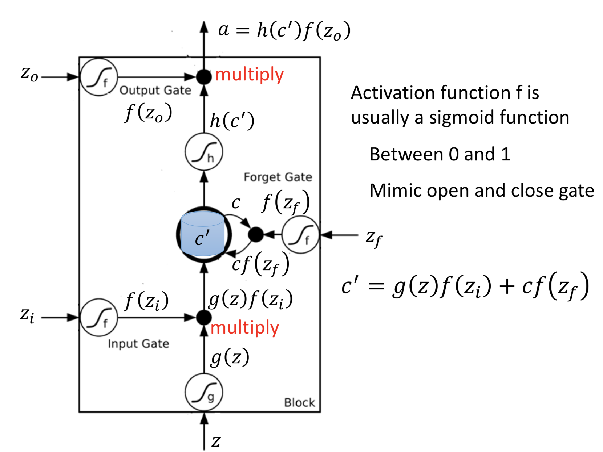
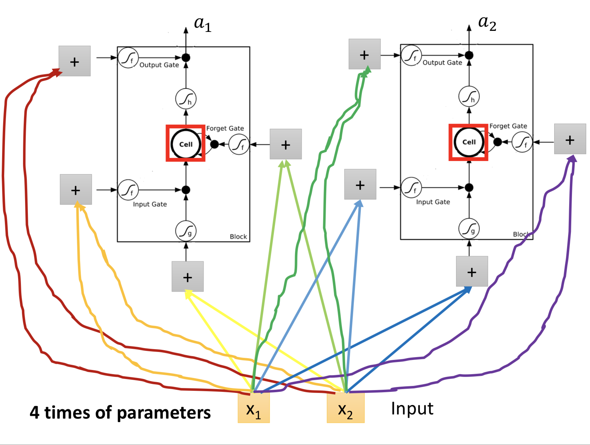
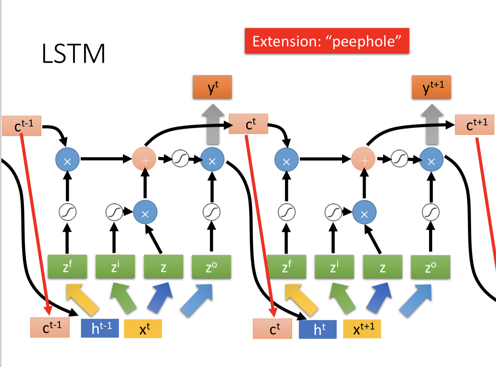

# Recurrent Neural Network
### 1 引入
从一个对话系统要做的一个任务 —— slot filling 开始引入。 举例如果用 CNN
等 feedfore network 去做会有什么困难和问题，然后引入 RNN，RNN 的循环特性让他能够让它结合上下文的信息，避免 CNN 在这个任务中的缺陷。（ RNN 一开始也是在 NLP 中兴起的，正如 CNN 从图像处理中兴起）

### 2 一个简单 RNN 的计算演示

### 3 LSTM
RNN 的几种类型：Elmam Network，Jordan Network
Bidirectional RNN，Long Short-term Memory (LSTM)

LSTM 的神经元 是 Special Neuron: 4 inputs,
1 output

之后是 LSTM 计算演示，非常详细！

下面这张图帮助理解记忆，非常好，直接贴！

上面这个看上去各种乱接，就会怀疑它能不能 work，结果就是还有更加复杂的，都有 train 出来的。

### 4 Learning - BPTT

Backpropagation through time (BPTT)

-------
