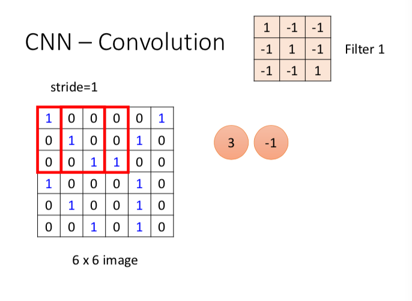
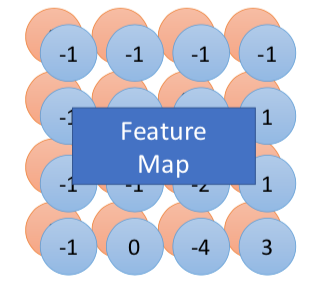
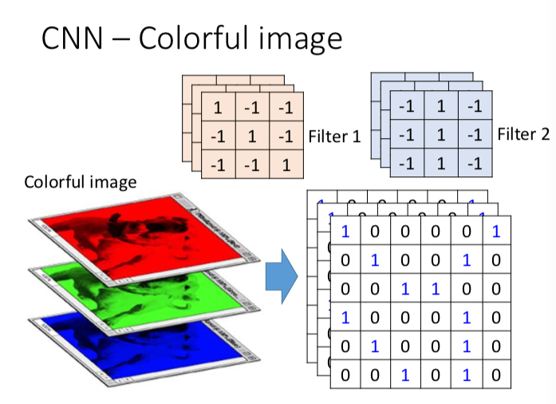
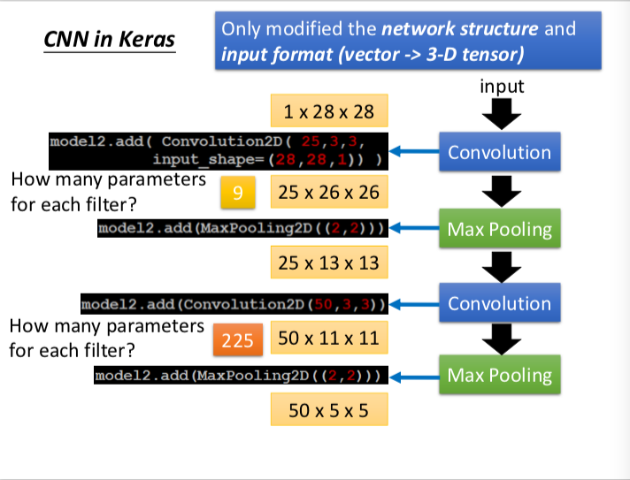
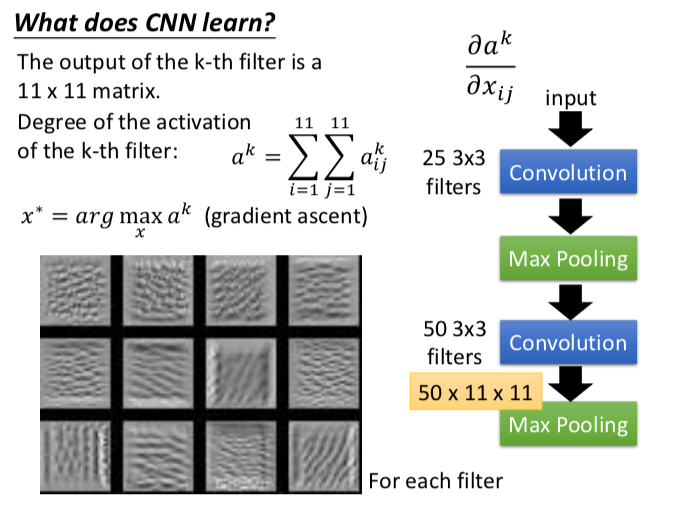

# ML Lecture 10: Convolutional Neural Network

CNN 在 2012 年的 ImageNet 比赛 大放异彩之后，就开始了。具体的历史之后再说，也不知道是怎么到现在视频介绍的这个架构的。。 估计是一种综合借鉴吧，以后还有兴趣再查再看发展中的重要论文也不迟。可供参考的别人整理的线索
> https://blog.csdn.net/xiangyong58/article/details/71213308
> 
> https://blog.csdn.net/u013088062/article/details/51118744

我们下面从图像处理的角度来引出 CNN

 
Can the network be simplified by considering the properties of images?

会想到 simplify，是因为参数太多了，限制了深度。如果能简化，在参数量一定的情况下，深度就可以更深了。

图像有三个特征：

1. 一些 pattern 只看图片的一部分就可以识别出来，而不需要看全图
2. pattern 出现在哪里，都是同一个 pattern，如手写数字图片中的数字，出现的方位与它所属的数字类别是无关的。 可以说是 pattern 具有平移不变性。
3. subsampling the pixel will not change the object，对图片的像素进行重采样，将图片缩小一半等都不好影响图片表示的物体。

### 首先是卷积
卷积是分析数学中一种重要的运算。
设：$ f(x)$ $g(x)$是$\mathbb{R}$上的两个可积函数，作积分：
$\int_{-\infty}^{\infty} f(\tau) g(x - \tau)\, \mathrm{d}\tau$

**之后补充，一定细究卷积，好吧。** 卷积究竟抓住了什么 pattern，为什么能抓住 pattern，数学上的原理呢，从卷积的数学定义、原理出发？

### CNN Framework

输入 - 卷积层 - Max pooling - 卷积层 - Max pooling - （卷积-Max pooling）*  —— Flatten - 全连接层 —— 输出层

下面分别介绍。

### 卷积层

卷积层做的就是卷积啦。所以，是怎么做？😂

首先，与卷积层有关的参数是 filter，它是卷积公式中不动的那个 f(x),移动的就是像素矩阵/输入矩阵。（你看一下上面写的卷积公式就知道了 filter 是不动的那个，然后这里做的是离散变量的卷积）

具体在某一个窗口下的话，就是內积呀！！！ （对应位置相乘然后求和）
> @acat 然后，又抛出一个问题，內积是什么？內积有什么性质？ 內积一开始是用在哪里？又是谁定义的？ 是不是开始觉得自己数学学得太差了，远远不够😂）之后再说，兄弟。现在只说是怎么做，先知道怎么做，才去想为什么。这就是先知道一个事情是什么之后，再去评价它。这是同样的道理。

示意图是这样子的，

当然，这里的每次窗口滑动的距离是由你设定的，用变量 stride 表示，上图就是 stride = 1 的情况，stride 也可以等于其他。移动到边缘时，若窗口中数目不够的时候，你还可以决定是否 padding，以补成可以计算的形状。

窗口移动方向是 两个方向，水平方向 和 竖直方向

有多个 filter ，就每个 filter 对着输入矩阵做一次卷积这样子。然后形成 feature map

如果是 color image 的话，有三个输入矩阵，（一个像素由三个值表示，RBG个一个），那么我们的做法是，把 R 的数值的矩阵 和其他两个矩阵叠起来，形成一个 立方体。见下图，很直观。 然后 每个 filter 对这三个矩阵做卷积，也叠起来，所以每个 filter 得到的卷积也是一个叠起来的立方体。
PS ： **对于 R，B,G  三层，一个 filter 会有不同的参数。就是说，其实下图的 每一个 filter 都有 3*3*3层 = 27 个参数**

但实现 CNN 上，肯定就不是像上面叙述的那样啦。上面叙述只是方便理论上的理解呀。实做上就是 （不太想写这里，再说吧）

但注意到，一个 CNN 层 其实就是一个简化连接的 全连接层，且要求一些参数的值进行共享！ （见 PPT P15-16）

## 下面是 Max pooling

也要设定 Max pooling 的窗口值，然后选窗口中值最大的那个。

## Flatten 

顾名思义，把立方体（提取的特征）展开成列向量，以输入全连接层。

来，检验你有没有理解的图片，（检查点在算参数方面）：

# What does CNN learn ？ 

把 CNN 学到的东西（判断方式） 可视化，具体要如何做呢？

最大化 filter 的输出 （最大程度激活 filter ）
定义 filter 的激活程度

然后将输入 x 当成未知变量，最大化x，如上图所示。

对于全连接层的神经元，同理可得。

后面是一些例子: Deep Dream, Deep Style ,  Playing Go, Speech , Text

（再写出自己的理解吧。他的 PPT 讲解得非常好呀）

待续

