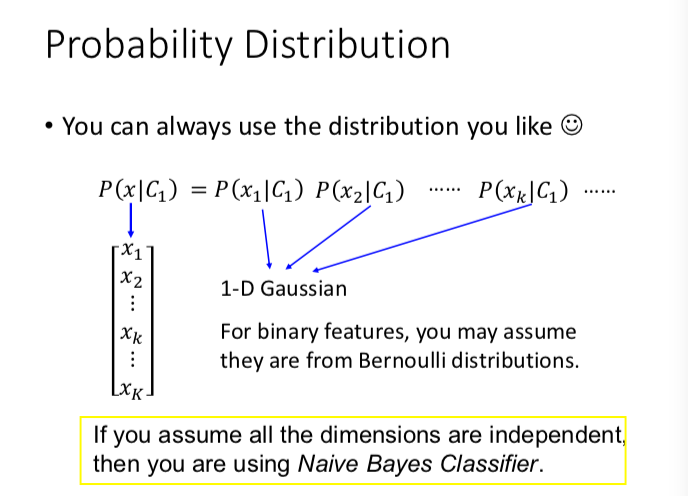
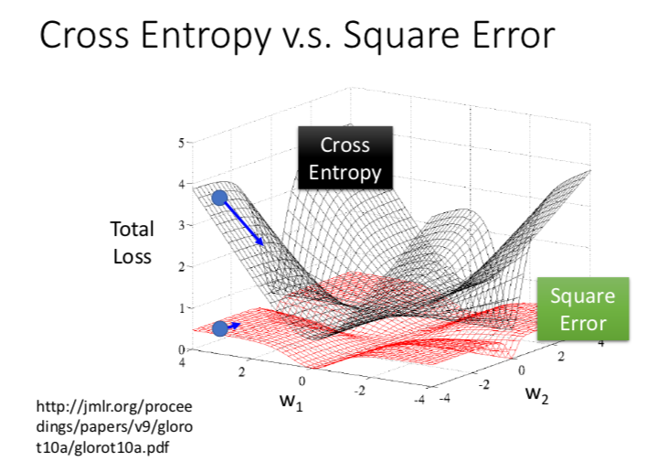

## ML Lecture 4: Classification : Probabilistic Generative Model

### 问题引入
先介绍什么是分类问题，然后举例子来说明，举一些小例子，然后详细叙述 神奇宝贝的例子！
还真是神奇宝贝 一直到底呀！！！

之后就是 case study ， 详细介绍了 如何预测神奇宝贝的属性类别，即进行分类，是水系还是普通系？

而后说明为什么不能用回归的方法做。
直接用回归的方法进行一下分类，你就知道它不好的地方了。
做过之后，有如下观察结果，用回归的方法去处理分类问题，产生不好结果的原因：

1 分类和回归的评价标准是不一样，用的 loss 是不一样的，（用回归会惩罚那些太正确的点，而这与我们的目标背道而驰）

2 处理多分类问题的时候，回归输出的是一个数值，如何决定用哪个数值表示哪个类呢？ 而且回归中，相近数值表示的类，其实你就假设了他们的近似关系，而这你是不知道的，或许这些类之间的关系其实一点都不近。这也是一个问题。

### 引入贝叶斯公式
举例，Tow Boxes， Two classes，主要是教你熟悉一下概率论中的贝叶斯公式啦

用生成式的方法做分类，
$p(C_1|x)= \frac{p(x|c_1)p(c_1)}{p(x)} = \frac{p(x|c_1)p(c_1)}{\Sigma p(x|c_i)p(c_i)}$

用生成式的方法做，要假设一种采集的样本点 所在的分布，在神奇宝贝的属性分类问题上，这里假设的是高斯分布（其他时候，要根据具体的任务，采集的样本点，来选择一种更合理，更有可能的分布）

多维高斯分布由两个参数决定， 一个是（向量） mean $\mu$  一个是协方差矩阵 $ \Sigma $

然后就是最大似然估计来计算参数，在已有样本上， 最大化 $ P = \prod p(true Class_i|x_i)  $
解出高斯分布的参数。

$ \mu ^* = \frac{\Sigma x^i }{ N }$ 

$ \Sigma ^* = \frac{ \Sigma (x^i-\mu^*)(x^i- \mu ^*)^T}{  N }$

N 是样本的数量。

然后数学推导出，其实 **逻辑回归 与 一个生成式的分类模型等价！**
那就是 (假设样本分布是高斯分布）当不同类别之间的协方差矩阵是相同的时候，生成式的概率模型等价于 逻辑回归模型。

解那些参数又多又麻烦，在这种假设下，直接解 w，b 可不可以呢？ 
？？**（原来逻辑回归是有隐含的假设的呀！！！！ 从这里知道）** ？？？
> 上面的推导依赖于假设的高斯分布吗？ ？？ 待思索 @acat
> 据讲解视频里，只要协方差相同，你的生成式模型分类和逻辑回归模型 表示的函数集是等价的。只是你的生成式模型会先假设一个概率分布，所以最后面选择出来的最好函数不是同一个，因为你假设一个概率分布，就会把原来等价的函数集取一个子集这样子。

逻辑回归不是多用于二分类问题？ 那样假设 协方差相同也很合理咯？？
（那 有一个问题，什么时候，假设不同类别的协方差相同是合理的？ 可以提前判断吗？ 还是只能通过分类效果不好来反推？@acat）

## ML Lecture 5 Classification: Logistic Regression

在给定分类函数 
$ f_{w,b}(x) = \sigma(\Sigma w_i x_i +b) $

又 $ \sigma(x) = \frac{1}{1+ e^{-x}}$

### 然后是 在最大似然估计情况下，推导出 逻辑回归的 Loss function （objective function）
首先是 $ P = L(w,b) = f(x^1|y^1=class1)*(1-f(x^2|y^2= otherClass))*...  $
就是 如果 x_1 是 class 1,我们就乘以 f(x_1),否则乘以 （1-f(x_1))
然后把所有样本的估计出现概率乘起来，在最大化这个概率，这就是最大似然估计呀。

从 $ arg max P(w,b) == min - \ln P(w,b) $
即我们要求极值的函数现在变为 $ - \ln P(w,b)$
将上面的 P(w,b) 联系起来，再用一个将 y 类别的 0-1编码 （trick）（等价于用y的类别为情况的 if-else，然后函数就可以写成一个统一的形式，之后也能求导，然后梯度下降求解啦。

统一的形式是， $ P(w,b)= min  Loss(w,b) = min - \Sigma (y^n \ln f(x^n) + (1-y^n)\ln(1-f(x^n)$

可以将上式看成是 两个 Bernoulli distribution 的交叉熵 

交叉熵 cross entropy 

for Distribution p,q
$ H(p,q) = - \Sigma p(x)\ln (q(x)) $

### 导数推导
要推导出 $ \frac{-\ln L(w,b)}{\partial w_i} $
后面才能用梯度下降等优化方法求解最优函数呀。

> 待自己补充，写出推导，@acat

### Question: Why don’t we simply use square error as linear regression?

视频中给出的原因就是，如果你用 square error 的时候，你优化求解的时候会遇到问题。如下图所示，（根源在于 偏导数上，可以推导--待补充）

### Discriminative v.s. Generative

@acat 基于视频，我的理解就是 生成式的模型需要对先验概率有一个极为准确的估计，最好就不从训练数据中计算，而从 要么是领域知识中得出（抛硬币），要么是其他大规模的数据中得出，好像很多语言模型做得那样。不然，你直接从你的训练数据估计类先验概率的话，如果训练数据的类比例是倾斜的，那么你的估计就 GG 了。

• Benefit of generative model

• With the assumption of probability distribution,
less training data is needed

• With the assumption of probability distribution, more robust to the noise

• Priors and class-dependent probabilities can be estimated from different sources.

> @acat（肯定是以后学习面广了之后，回来补充这一比较吧，我想）

### Muti-Class classification - LR

首先是 one-vs-all ， 每个类 会有一个 二分类的 LR,  参数分布为 W_i,b_i
然后放大比较大的，概率归一化输出，就是用 softmax 啦。

$ softmax(z_i) = \frac{e^{z_i}}{\Sigma e^{z_i}}   $  z 是一个向量

### Limitation of Logistic Regression

Feature Transformation or 让它自己学习合适的特征处理（转换）

Cascading logistic regression models

从这里引出 Neural network -- deep learning， 可谓水到渠成，过渡得合乎逻辑，因而显得自然，让我觉得赏心悦耳 O(∩_∩)O哈哈~

